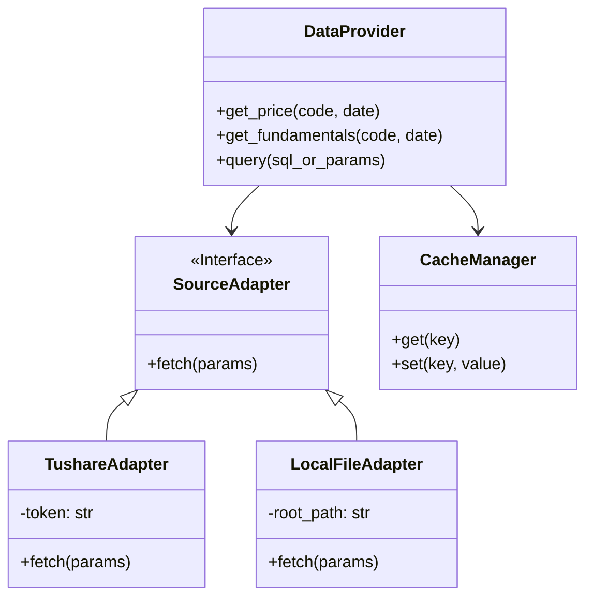

# 模块设计：数据管理 (Data Management)

## 1. 概述
数据管理模块 (`vibe_data`) 是系统的基石，负责所有结构化数据的获取、清洗、缓存和持久化。它通过适配器模式屏蔽了底层数据源（Tushare API、本地 CSV、数据库）的差异，为上层业务模块提供统一的 Pandas DataFrame 格式数据。

## 2. 架构设计



## 3. 核心组件

### 3.1 DataFactory (数据工厂)
*   **职责**: 根据配置（如 `config.yaml`）初始化具体的数据源适配器。
*   **逻辑**: 如果处于“回测模式”，优先加载 `LocalFileAdapter`；如果处于“实盘模式”，加载 `TushareAdapter` 并配置 Redis 缓存。

### 3.2 Adapters (适配器)
*   **TushareAdapter**:
    *   封装 Tushare SDK (`ts.pro_api()`)
    *   **流量控制**: 实现 Token 桶算法，防止超过 Tushare 每分钟调用限制。
    *   **重试机制**: 网络超时自动重试 3 次。
*   **LocalFileAdapter**:
    *   **映射**: 将 API 请求映射到本地 `D:\vibeStock\tushare\` 目录下的 Markdown 或 CSV 文件。
    *   **解析**: 解析 Markdown 表格为 DataFrame。

### 3.3 Persistence (持久化)
*   **热数据**: 当日实时行情存入 Redis (Key: `quote:{code}:{date}`).
*   **冷数据**: 历史日线、财务报表存入 PostgreSQL 或 Parquet 文件（按年分文件夹）。

## 4. 接口定义 (API)

```python
def get_history_bars(code: str, start: str, end: str, freq='1d') -> pd.DataFrame:
    """获取历史K线"""
    pass

def get_snapshot(codes: list) -> dict:
    """获取最新切片数据（实盘为最新Tick，回测为当前回测时间点的收盘价）"""
    pass
```
