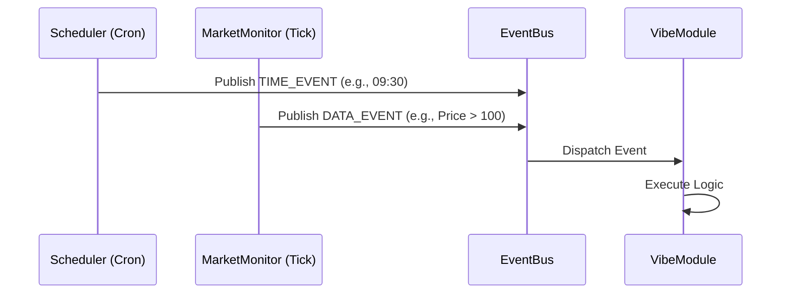

# 模块设计：驱动与触发系统 (Driver & Trigger)

## 1. 概述
驱动系统 (`vibe_driver`) 是系统的“心脏”，负责产生事件流。它将时间流逝、市场状态变化、数据更新等异构信息统一转换为标准的 `VibeEvent`，并分发给事件总线。

## 2. 架构设计



## 3. 核心组件

### 3.1 EventBus (事件总线)
*   **职责**: 简单的发布/订阅模型。
*   **实现**: 进程内使用 Python `queue.PriorityQueue`；跨进程/分布式使用 Redis Pub/Sub。
*   **事件结构**:
    ```python
    class Event:
        type: str      # e.g., 'TIMER', 'QUOTE', 'NEWS'
        topic: str     # e.g., 'market.open', '000001.SH'
        payload: dict  # 数据载荷
        timestamp: int # 事件发生时间
    ```

### 3.2 Drivers (驱动器)
*   **ClockDriver (时钟驱动)**:
    *   基于 `APScheduler`。
    *   生产 `MARKET_OPEN`, `MARKET_CLOSE`, `EVERY_MINUTE` 等系统事件。
*   **DataDriver (数据驱动)**:
    *   轮询行情接口（实盘）或读取下一行数据（回测）。
    *   当价格变动 > X% 或成交量突增时，生成 `PRICE_CHANGE` 事件。
*   **WebhookDriver (外部驱动)**:
    *   启动一个轻量级 HTTP Server (FastAPI)。
    *   接收外部 POST 请求（如 TradingView 报警），转化为系统内部事件。

## 4. 触发逻辑

模块通过在 `config` 中声明 `triggers` 来订阅事件：

*   **分时触发**: `triggers: [{type: 'cron', value: '*/5 * * * *'}]` (每5分钟)
*   **条件触发**: `triggers: [{type: 'expression', value: 'quote.price > ma20'}]` (需配合计算引擎)
