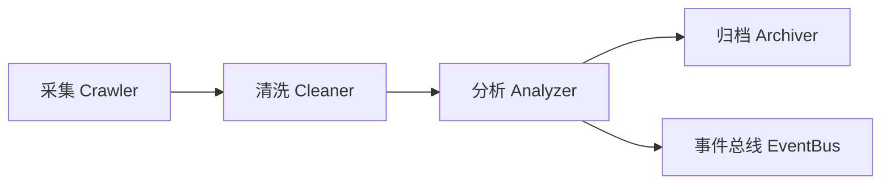

# 模块设计：内容爬取与分析 (Content ETL)

## 1. 概述
内容模块 (`vibe_crawler`) 负责处理非结构化数据。它不仅是简单的爬虫，更是一个 ETL (Extract, Transform, Load) 管道，负责将新闻、研报、截图转化为可量化的“信号”。

## 2. 处理流程

## 3. 核心组件

### 3.1 采集器 (Crawlers)
*   **WebCrawler**: 基于 `Playwright` 或 `httpx`，处理动态网页（如雪球、财联社电报）。
*   **ImageCrawler**: 专门针对龙虎榜截图、分时图。
*   **FileWatcher**: 监控特定文件夹（如 `tushare/` 目录），当有新 Markdown 文件生成时自动触发处理。

### 3.2 分析管道 (Pipeline)
*   **OCR Processor**:
    *   使用 `PaddleOCR` (本地) 或 通用大模型 API。
    *   功能：将图片中的表格转换为 Pandas DataFrame。
*   **NLP Processor**:
    *   **实体识别 (NER)**: 识别文本中提到的 股票代码、机构名称。
    *   **情感分析**: 给新闻打分 (-1.0 到 1.0)。
    *   **摘要生成**: 使用 LLM (Gemini/OpenAI) 总结长研报。

### 3.3 归档与输出
*   **原始存档**: 爬取的 HTML/图片保留在 `data/raw/{date}/`。
*   **信号输出**: 生成 `SentimentEvent` (情绪事件)。
    *   示例: `Payload: {code: '300059', source: 'news', sentiment: 0.8, keywords: ['利好', '中标']}`

## 4. 扩展性
支持通过编写简单的 Python 脚本添加新的爬虫源，只需继承 `BaseSpider` 类并实现 `parse()` 方法。
