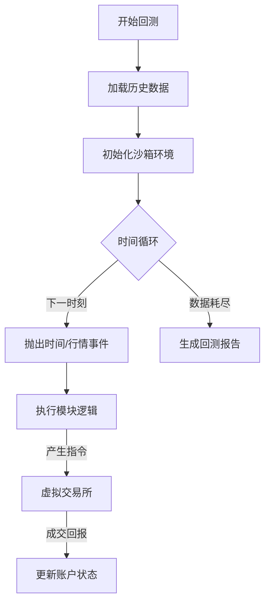

# 模块设计：历史回测引擎 (Backtest Engine)

## 1. 概述
回测引擎 (`vibe_backtest`) 允许用户在不修改任何代码的情况下，验证 Vibe 模块在历史数据下的表现。其核心思想是“时间欺骗”和“环境沙箱”。

## 2. 核心原理：时间旅行 (Time Travel)

### 2.1 虚拟时钟
在回测模式下，`Context.now` 不再返回系统时间，而是返回回测游标当前指向的时间。
*   调度器 (`Scheduler`) 被替换为 `BacktestScheduler`，它不是等待真实时间流逝，而是一个 `while` 循环，按时间戳顺序快速抛出事件。

### 2.2 事件重放 (Event Replay)
1.  **加载数据**: 读取指定时间段的 `tushare/历史分钟.md` 或 Tick 数据。
2.  **生成流**: 将静态数据拆解为一系列带时间戳的 `VibeEvent`。
3.  **注入总线**: 将这些事件推送到 EventBus，触发订阅了该数据的模块。

## 3. 沙箱环境 (Sandbox)

为了防止回测污染真实环境（如误发交易指令、误发报警消息），回测使用了 Mock 对象：

| 真实组件 | 回测组件 | 行为差异 |
| :--- | :--- | :--- |
| `TushareAdapter` | `LocalFileAdapter` | 禁止联网，仅读本地历史缓存 |
| `Output.notify` | `MockNotify` | 记录日志，不发送 HTTP 请求 |
| `Output.trade` | `VirtualBroker` | 模拟撮合，维护虚拟账户资金/持仓 |

## 4. 流程图

## 5. 性能优化
*   **预加载**: 内存足够时，一次性将回测所需数据加载到 RAM。
*   **批量处理**: 对于非高频策略，支持按“日”而非“Tick”步进。
