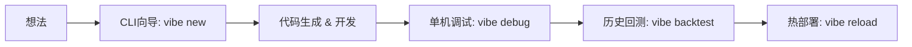

# 模块设计：Vibe 开发者工作流 (Developer Workflow)

## 1. 概述
为了实现“快速制作新模块”的目标，我们需要提供一套完善的开发者工具链 (DevTools)。这套工作流旨在将从“产生想法”到“模块上线”的过程缩短至分钟级，通过脚手架、交互式向导和独立的调试环境来降低开发门槛。

## 2. 工作流全景图



## 3. 核心工具：Vibe CLI

增强现有的 CLI 工具，使其成为模块开发的核心入口。

### 3.1 交互式创建 (`vibe new`)

不再是简单的复制文件，而是通过问答生成定制化代码。

*   **命令**: `vibe new <module_name>`
*   **交互流程**:
    1.  **选择类型**:
        *   [1] 简单的定时任务 (Cron Job)
        *   [2] 实时行情监控 (Market Monitor)
        *   [3] 舆情/新闻分析 (Sentiment Analyzer)
        *   [4] 复合策略 (Complex Strategy)
    2.  **配置触发器**:
        *   "需要订阅哪些股票？(输入 'All' 或代码列表)"
        *   "监控频率是多少？(Tick/1min/1day)"
    3.  **定义输出**:
        *   "触发后需要做什么？(通知/交易/记录日志)"

*   **产出**:
    *   `modules/<name>.py`: 包含样板代码、类型提示和 TODO 注释的主逻辑文件。
    *   `modules/<name>.yaml`: (可选) 独立的配置文件，如果配置较复杂。

### 3.2 快速调试 (`vibe debug`)

在不启动整个系统的情况下，单独运行一个模块并注入模拟事件。

*   **命令**: `vibe debug <module_path> [options]`
*   **功能**:
    *   **--mock-event**: 传入 JSON 字符串直接触发 `on_event`。
        *   示例: `vibe debug my_mod.py --event '{"type":"quote", "price": 10.5}'`
    *   **--replay**: 指定某几分钟的历史数据进行微型回测。
        *   示例: `vibe debug my_mod.py --replay "2023-01-01 09:30~09:35"`
    *   **Live Reload**: 监听文件修改，保存即重新运行，类似前端开发的 HMR。

### 3.3 模块探查 (`vibe inspect`)

查看当前运行中模块的状态，用于诊断问题。

*   **命令**: `vibe inspect <module_name>`
*   **输出**:
    *   当前内存状态 (`self.state` 的值)。
    *   最近 10 次触发的时间和耗时。
    *   最近的错误日志。

## 4. 模板系统 (Templates)

在 `templates/` 目录下预置标准化的代码模式：

### 4.1 基础模板 (Basic)
最简单的结构，仅包含 `initialize` 和 `on_event`，适合初学者。

### 4.2 技术指标模板 (Indicator)
预置了 `talib` 或 `pandas` 计算逻辑。
```python
# 自动生成的代码片段
def on_tick(self, tick):
    # 自动维护一个 K 线 buffer
    self.bars.update(tick)
    if self.bars.macd_cross_up():
        self.emit_signal(...)
```

### 4.3 爬虫模板 (Crawler)
预置了 `BeautifulSoup` 或 `Playwright` 的框架，以及去重逻辑。

## 5. IDE 集成辅助

*   **Type Stubs (`.pyi`)**: 为 `vibe_core` 提供完整的类型定义文件，确保在 VS Code / PyCharm 中有完善的代码补全。
*   **Snippets**: 提供 VS Code 插件或配置片段，输入 `vibe-trigger` 自动展开为触发器配置代码。

## 6. 测试驱动开发 (TDD) 支持

创建模块时，自动生成对应的测试文件 `tests/test_<module_name>.py`。

```python
# 自动生成的测试代码
def test_my_module_logic():
    # 1. Setup: 创建模块和模拟上下文
    mod = MyModule()
    ctx = MockContext()
    mod.initialize(ctx)

    # 2. Act: 发送模拟事件
    mod.on_event(Event(price=100))

    # 3. Assert: 验证是否产生了预期的输出
    assert ctx.output.sent_messages[0].content == "Price alert: 100"
```
