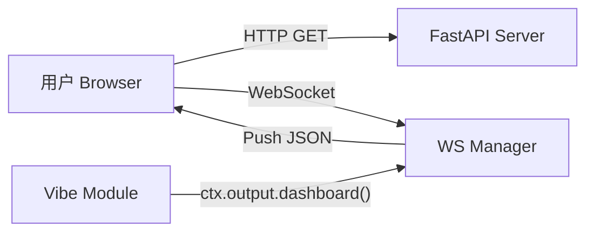

# 模块设计：监控面板 (Dashboard UI)

## 1. 概述
监控面板 (`vibe_ui`) 是 vibeStock 系统的可视化前端。它提供了一个基于 Web 的实时界面，用于展示行情、策略状态、系统日志以及进行简单的交互控制。

## 2. 架构设计

采用 **B/S 架构**，前后端分离但由同一服务托管。

*   **后端**: FastAPI (Python)
    *   提供静态文件服务 (`/ui`).
    *   提供 WebSocket 端点 (`/ws`) 用于实时数据推送.
    *   提供 REST API (`/api/settings`) 用于配置修改.
*   **前端**: HTML5 + Vanilla JS + Vue3 (CDN) + ECharts.
    *   无复杂的构建步骤，易于修改和部署.
*   **通讯**:
    *   `vibe_core` -> `OutputManager` -> `WebSocketManager` -> `Browser`.



## 3. 界面布局 (Layout)

### 3.1 顶部工具条 (Header Bar)
*   **状态**: 只有鼠标悬停或点击顶部区域时显示 (Auto-hide)，或者通过按钮折叠。
*   **内容**:
    *   **Logo/Title**: vibeStock.
    *   **System Status**: CPU/内存占用，运行时间。
    *   **Settings Btn**: 打开设置模态框 (修改 API Token，刷新频率等)。
    *   **Log Console Toggle**: 显示/隐藏底部日志窗口。

### 3.2 网格工作区 (Grid Workspace)
*   采用响应式网格布局 (Grid Layout)。
*   每个模块可以注册一个或多个 "Widget" (小组件)。
*   **Widget 类型**:
    *   `TableWidget`: 适用于自选股列表、持仓列表。
    *   `ChartWidget`: 适用于 K 线图、资金曲线 (基于 ECharts)。
    *   `TextWidget`: 适用于简单的状态显示或报警信息。

## 4. 通信协议

WebSocket 消息格式 (JSON):

```json
{
  "type": "update",
  "widget_id": "watchlist_monitor",
  "data": {
    "rows": [
        {"code": "000001", "price": 12.5, "change": "+1.2%"}
    ]
  }
}
```

## 5. 预置测试模块

为了验证面板功能，实现以下两个测试模块：

### 5.1 自选股监控 (WatchlistMonitor)
*   **Widget ID**: `watchlist_main`
*   **功能**: 模拟或读取 5 只股票的实时价格。
*   **展示**: 表格形式 (代码, 名称, 现价, 涨跌幅)。
*   **更新频率**: 每 3 秒推送一次更新。

### 5.2 上证指数 K 线 (IndexChart)
*   **Widget ID**: `chart_sh000001`
*   **功能**: 展示上证指数最近 30 天的日线数据。
*   **展示**: 蜡烛图 (Candlestick)。
*   **更新**: 初始化时推送全量历史，后续不频繁更新。

## 6. 实现计划
1.  建立 `vibe_server` 目录存放 FastAPI 代码。
2.  建立 `ui` 目录存放 `index.html`。
3.  修改 `Context` 增加 `to_dashboard` 方法。
4.  编写测试模块 `modules/ui_test_*.py`。
